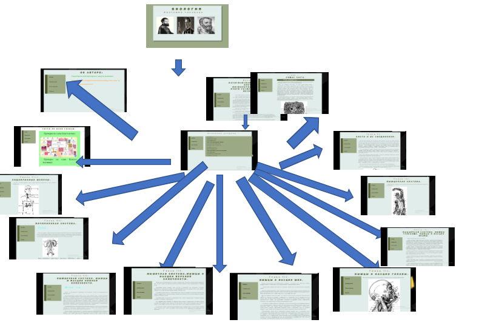

# Основы анатомии человека
## Основная часть
### Цель 
Создать сайт с удобным интерфейсом и строгим дизайном
предназначенный для преподавателей и школьников, учащих делать сайты

### Задачи
+ Собрать текстовую информацию по теме: основы анатомии человека
+ Создать некоторое число тестов, для проверки усвоенного матерела
+ Систематизировать собранную информацию, разобрать дизайн для сайта:
    + композицию
    + цветовую гамму
    + расположение элементов на страницах
+ Создать макет страницы в текстовом редакторе
+ Пользуясь знаниями и не знанием, в частности, языка HTML, создать, протестировать и отладить код

### Структура сайта

### Вёрстка

Для своего сайта я выбрал блочную вёрстку сайта(`div`). Одним из решающих моментов при выборе данного типа был меньший объём кода, чем у табличной и как в следствии более быстрая загрузка сайта, так как основная часть описания визуального вида выносится в css-файлы, которые загружаются одноразово, и поэтому просто кэшируется браузером. Фреймовая вёрстка также сокращает код, но ряд недостатков, которые она имеет, заставили меня сделать выбор в пользу блочной вёрстки. Во-первых, сайты с фреймовой структурой ну всегда отображаются в браузерах, потому что не все браузеры её поддерживают. Во-вторых, дизайн фреймов грубоват, а у блоков он более гибкий и приятный, так как существует множество css-стилей для них.

### CSS
Существует три способа подключения каскадной таблицы стилей:
1. Внутренние таблицы стилей (параметр стиля прописывается внутри HTML-тэга)
2. Встроенные таблицы стилей (таблица стилей вставляется в заголовок
HTML-страницы
3. Внешние таблицы стилей (находится в отдельном файле)

Для своего сайта я выбрал последний способ, так как его можно создать один раз и контролировать сразу несколько HTML-страниц. Кроме того, данный способ значительно сокращает HTML-код. Чтобы подключить таблицу внешнюю таблицу стилей, в заголовке документа нужно прописать: `<link rel="stylesheet" type="text/css" href="css/main.css">`

### Работа с текстом
Текстовая информация заключается в тэги `
` и ``, параметры которых настроены с помощью каскадной таблицы стилей CSS.	
	
Для тэга `<pre>` использовался шрифты: Consolas, Monaco, 'Andale Mono', 'Ubuntu Mono'
	
Для всего остольного шрифт Arial

### Работа с приложениями.

Также, я работал с приложением learningapps.org, для создания сайтов, которые помогут закрепить полученную информацию.

## Заключение
Создавая учебно-методическое пособие , я научился работать с разными приложениями , таблицами и списками. В процессе работы над проектом я собрал систематизировал информацию. Материалы сайта могут быть использованы учителями и учениками на уроках биологии, а также для подготовки к ЕГЭ и для самообразования.

## Используемые ресурсы:
+ http://massagelib.ru/books/item/f00/s00/z0000040/index.shtml
+ https://colorscheme.ru/html-colors.html
+ http://www.webremeslo.ru
+ https://learningapps.org