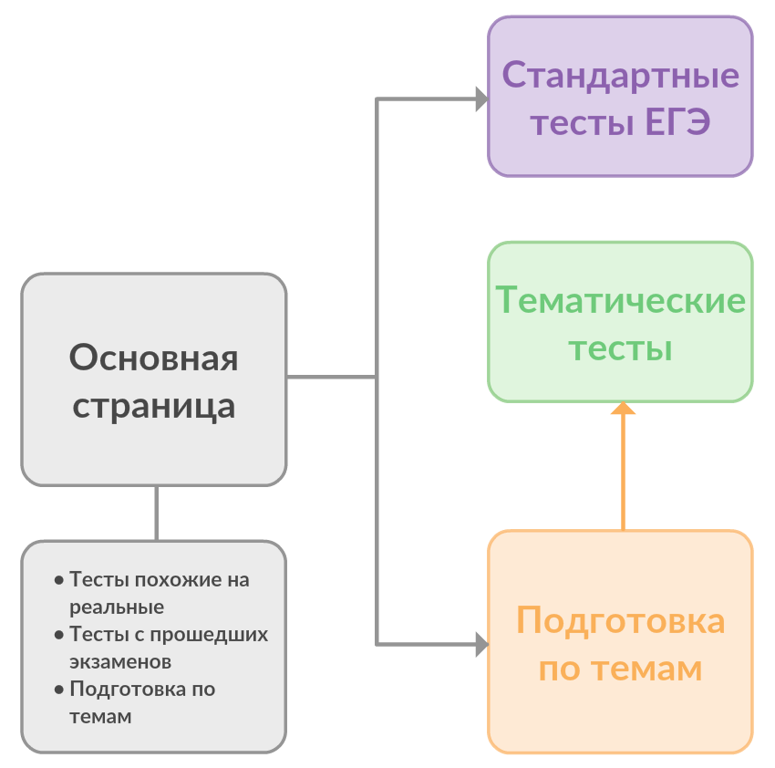

# О проекте
В настоящее время знания в области математики являются необходимым условием успешной сдачи ЕГЭ и, как следствие, поступления в ВУЗ, а также являются признаком образованности человека. Математика является неотъемлемой частью современной жизни. Математика обеспечивает прогресс и развитие человеческого общества. Поэтому важно изучать математику. Этот сайт предоставляет возможность улучшить свои знания в математике и подготовиться к ЕГЭ.

На этом сайте представленна информация для подготовки, обучающие видеоматериалы и тесты. Он может служить как дополнительный материал для подготовки к ЕГЭ или для повышния уровня знаний.

# Основная часть
При создании подобного проекта считаю выжным поставить следующие цели.
    
## Цели
+ Создать удобное и функциональное методическое пособие.
+ Предоставить пользователю возможность отслеживать свой прогресс.
+ Построить структуру сайта подготовленную для простой модификации и расширения функционала.

Исходя из данных целей можно определить следующие задачи.

## Задачи
1. Собрать необходимую информацию.
2. Структурировать и обработать полученную информацию.
3. Определить парадигму дизайна сайта.
4. Продумать удобную и функциональную структура сайта.
5. Определить инструменты и технологии для создания сайта.
6. Разработать основу сайта.
7. Обеспечить сайт разработанным ранее дизайном и наделить задуманным функционалом.
8. Наполнить сайт необходимой информацией.
9. Доработать сайт для возможности будущей модификации.

## Реализация проекта

### Дизайн

Для данного сайта была выбрана концепция [Material](https://material.io/design/) дизайна разработанная компанией Google. Данная концепция берет за основу принцип того, что определенные форма и цвет объектов несут определенные свойства и функционал. Так элементы дизайна какбы создают ощещение объектов физического мира.

Данная концепция построения пользовательских систем уже давно получила мировое признание и используется например в ОС Android.

Для реализации такого дизайна я использовал библиотеку для React - [MATERIAL-UI](https://material.io/design/).

### Используемые технологии

#### React 
Разработанная Facebook библиотека для JavaScript. Она предлагает следующие преимущества:
+ Легкость и интуитивность синтаксиса.
+ ООП принцип в создания веб страниц.
+ Простая масштабируемость.
+ Особый подход к прорисовке WEB компонентов позволяет не скачивать информацию об элементах не обновляющихся при загрузке страницы.
+ Отдельный момент в том что эта технология сейчас очень популярна и ползена для изучения.

Синтаксис React незамысловат и является по сути смесью HTML и JavaScript. Это делает его простым для изучения и использования. Для сохранения кода в формате React используется тип файлов JSX. 

Пример кода: 
```javascript
class TestItem extends React.Component {
    constructor(props) {
        super(props);
        this.state = {
            task_count: [],
            ans: false
        };
    }
    render () {
        return (
            <GridItem xs={12} sm={4} md={4} className={classes.progressCell}>
                <div>
                    <h4>Решено задач</h4>
                    <div className={classes.progressBox}>
                        <CircularProgress className={classes.progress} variant="static" value={Math.floor(this.state.task_count*100/18)} size={160} thickness={22} color='secondary'/>
                    </div>
                    <h2>{this.state.task_count} / 18</h2>
                </div>
            </GridItem>
        )
    }
}
```

#### JavaScript
Язык программирования обеспечивающий взаимодействие сайта с пользователем. Чистый JavaScript код не использовался при написании проекта, однако, он я вляется непосредственной частью библиотеки React.

#### SCSS и CSS
Надстройка и непосредственно каскадная таблица стилей. Использовались для управения внешним видом элементов и дизайна сайта в целом.

#### HTML
Язык гипертекстовой разметки. По прежнему используется для создания каркаса веб сайта. Чистый HTML код не использовался при создании проекта, однако, он является непосредственной частью библиотеки React. HTML сам по себе устаревающая технология и не соответсвует потребностям по разработке и функционированию сайтов.

#### FireBase 
Система облачных технологий разработанная Google. Из них я использовал:
+ Систему регистрации пользователей.
+ Быстрые базы данных.
+ Хостинг для сайта.

#### NPM
Удобный пакетный менеджер. Использовался для:
+ Управления необходимыми библиотеками.
+ Сборки проекта для размещения на сервере.
 
#### Git и GitHub
Система контроля версий и вебсервис для хранения и публикации проекта. Были необходимы для:
+ Отслеживания разных версий проекта и их управления.
+ Непосредственной публикации кода проекта в интернете и удобного к нему доступа

### Верстка страниц
При написании сайта использовалась блочная верстка (основанная на тегах `<div>`) так как она наиболее хорошо соответствует современным требованиям в web-разработке. Так табличная и фреймовая типы верстки устаревают и не обеспечивают необходимый функционал. Постепенно браузеры прекращают поддержку данных типов верстки.

### Структура сайта
#### Особенности
Отличительной особенностью сайтов написанных на React является особое взаимодействие с DOM (Document Object Model — «объектная модель документа»). Это значит что React по-особенному отрисовывает графическую составляющую сайта. Любое приложение написанное на React по сути представляет собой только одну веб страницу. Когда осуществляется переход на другой раздел сайта, новая страница не загружается, а только перерисовываются изменяемые элементы. Это позволяет:
+ Уменьшить потребляемый сайтом трафик.
+ Ускорить пользовательское взаимодействие с сайтом.

Таким образом сайт имеет только условную структуру.

#### Условная структура


# Результат
Я считаю что я справился с поставленной целью. Получившийся сайт обладает следующим функционалом:
+ Учебные материалы для подготовки по темам включая видеоролики.
+ Возможность проходить тестирование трех разных типов:
    + Классические тесты похожие на настоящие.
    + Реальные тесты с прошедших во Владимирской области экзаменов.
    + Отдельные тесты по конкретным темам для углубленной подготовки.
+ Уже настроенная пользовательская система позволит в будущем отслеживать индивидуальный прогресс пользователя и делать акцент на слабых местах.

Сильными сторонами своего сайта я считаю:
+ Малое количество кода. Который генерируется автоматически в зависимости от содержимого.
+ Легкая масштабируемость под новые данные и функционал.
+ Единая концепция дизайна используемая дизайнерами по всему миру, что создает удобный и практичный интерфейс
+ Использование сервисов авторизации и баз данных что обеспечивает надежное их хранение и надежную работу.
+ Использование современных технологий и библиотек. Это позволяет сохранять поддержку сайта более длительное время.

# Материалы
При подготовке проекта я пользовался ресурсами или информацией из данных источников:
+ [React](https://reactjs.org)
+ [Firebase](https://firebase.google.com)
+ [Redux](https://redux.js.org)
+ [Unsplash](https://unsplash.com) - картинки
+ [StackOverflow](https://stackoverflow.com) - куда же без него