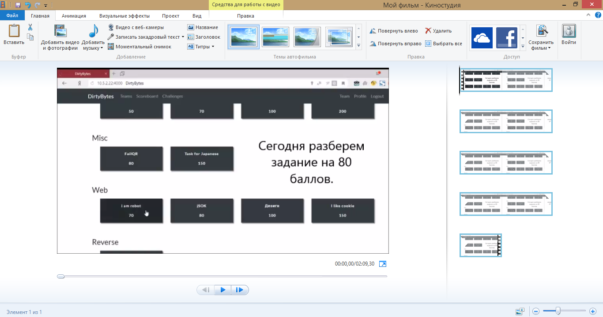
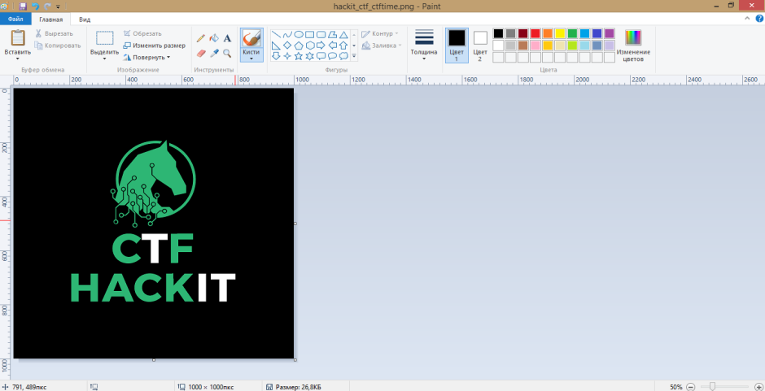
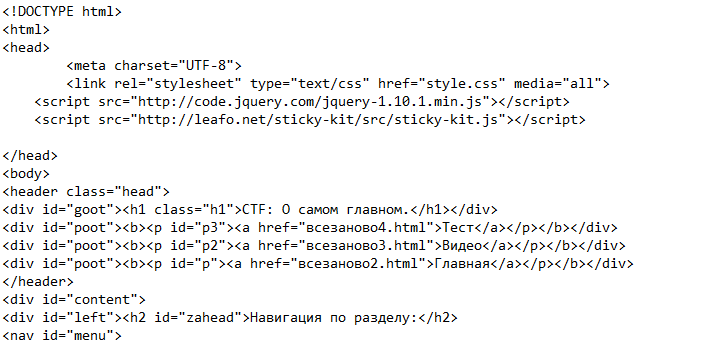
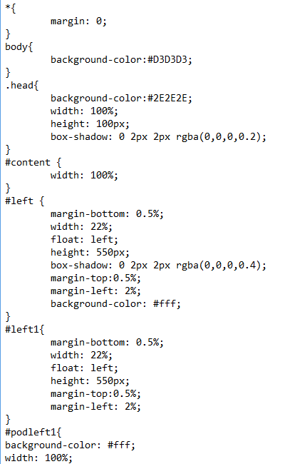
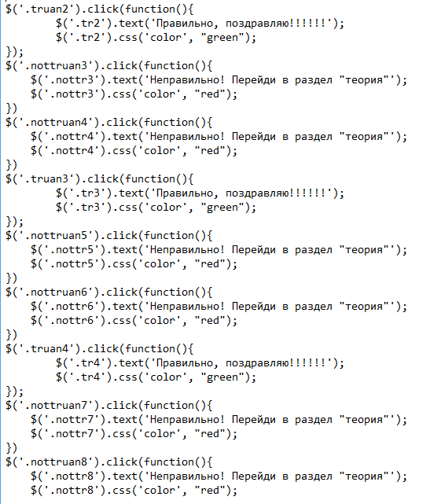
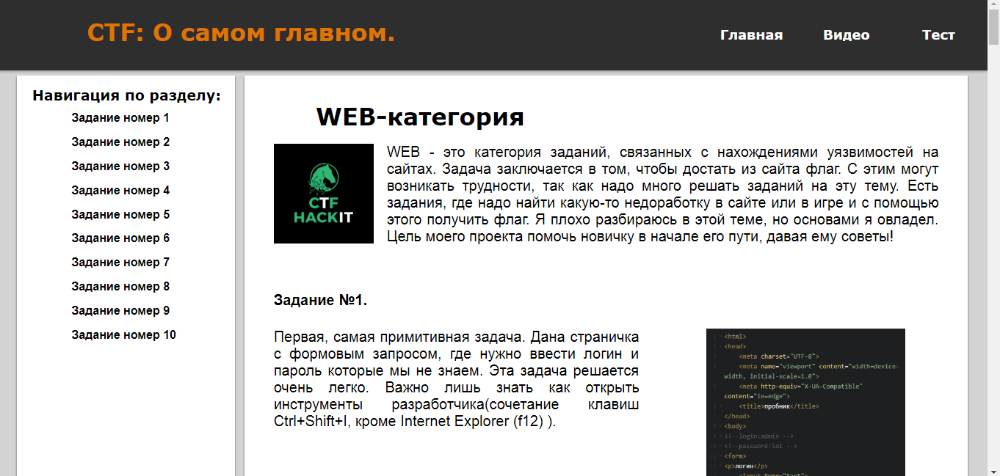
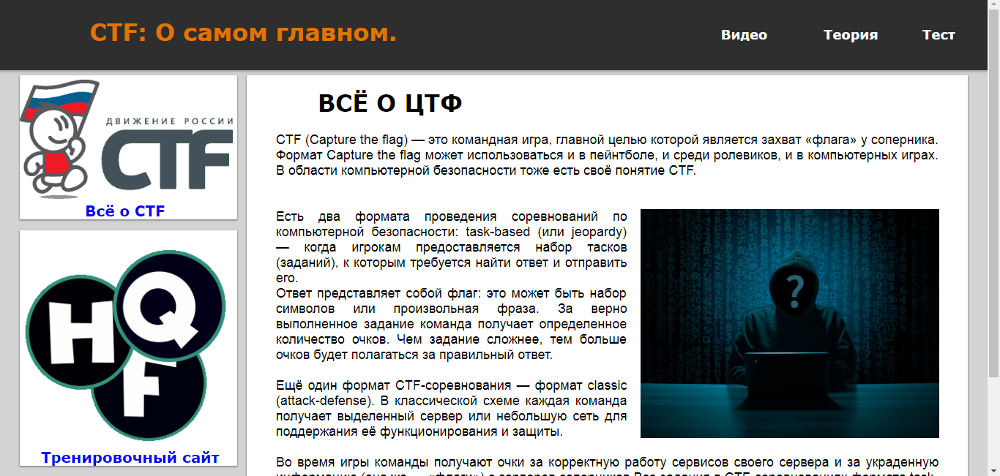
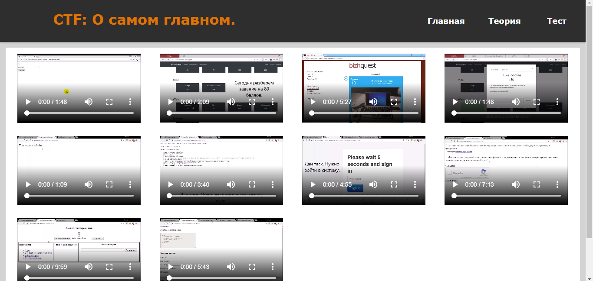

# CTF (Соревнования по компьютерной безопасности)

## О проекте
Моя тема очень актуальна в нынешнее время, так как сейчас век разных (в особенности компьютерных) технологий. Я хотел бы вам представить соревнования, которые называются Capture the flag (захват флага, далее CTF). В классическом CTFe пользователь может узнать много нового в сфере компьютерной безопасности. А сейчас безопасность очень важна для многих предприятий.

## Основная часть
### Цели
+ Создать сайт с эффективным удобным дизайном, не    отвлекающим внимания от основной информации
+ Создать учебно-методическое пособие для общего познания и подготовки к соревнованиям по компьютерной безопасности. 
### Задачи
+ Собрать информацию по теме
+ Собрать материал, наглядно и доступной форме
+ Спроектировать дизайн сайта
+ Создать HTML-код
+ Исследовать основы языка гипертекстовой разметки (HTML) по имеющимся материалам
### Этапы работы
1. Определение проблемы и ее актуальности.
2. Сбор и систематизация информации по теме.
3. Оформление проекта.
4. Подготовка публичного выступления и защита проекта.
        
Что касается моего сайта, то я решил выбрать фон светло-серого оттенка с темной шапкой, так как одним из самых важных элементов дизайна веб-сайта является цвет. Я решил создать динамичный сайт, так как плавность и динамичность привлекает читателя. Мой сайт имеет деловитый стиль, так как цель создания сайта это учебно-методическое пособие.

### Работа с видео
Для работы с видео я использовал программу записи экрана Bandicam и программу для обработки видео Киностудия. К сожалению, все мои ролики были представлены без звука, так как у меня проблемы с микрофоном. Эту проблему я решил, добавив субтитры в видеоролики. 

### Работа с изображениями.
Для работы с изображениями я использовал Microsoft Paint — многофункциональный, но в то же время довольно простой в использовании растровый графический редактор компании Microsoft, входящий в состав всех операционных систем Windows, начиная с первых версий.

## Построение информационной модели
1. Сбор и отбор информации, которую я брал с других сайтов. 
2. Написание кода на языке гипертекстовой разметки (HTML). В этом же шаге присутствует написание кодов на CSS — формальный язык описания внешнего вида документа, написанного с использованием языка разметки. Преимущественно используется как средство описания, оформления внешнего вида веб-страниц, написанных с помощью языков разметки HTML и XHTML и JavaScript — мультипарадигменный язык программирования. Поддерживает объектно-ориентированный, императивный и функциональный стили

### HTML
Мой код на HTML получился немного громоздким, но он работает так, как я и задумывал. В моем коде присутствуют якоря, с помощью которых я упростил передвижение на вкладке «Теория».  Мне удалось сделать главное меню, которое находится в шапке сайта. Там находится навигация по страничкам. Также мне удалось создать тестовые задания с помощью тега `<input>`.

### CSS
В своем коде я прописал стили CSS непосредственно в коде меню. С помощью CSS сделал свой сайт намного красивее. Снизу представлена лишь малая часть написанного мной кода. Он составляет около 300 строк.

### JavaScript
С помощью JavaScript я сделал сайт динамичным. Я сделал специальную кнопку, которая возвращает пользователя с конца страницы в ее начало. Также с помощью JS я реализовал плавное перемещение по заданиям на вкладке «Теория» и написал простейший код для проверки своих знаний, то есть создал тестовые задания. На других своих сайтах мне удавалось создавать прелоадеры. Прелоадер  —  это индикатор загрузки сайта. 

## Вёрстка страниц
Существует три вида вёрстки сайтов: табличная, блочная и фреймовая. Я выбрал блочную вёрстку, потому что, на мой взгляд, она проще остальных и сайт получается красивее. Блочная вёрстка представляет собой страницу с прямоугольными блоками (`
…
`). Такие блоки на странице можно располагать любым образом.

## Структура сайта

                    
## Заключение
В процессе моей работы я скомпоновал, систематизировал информацию по заявленой теме. Материалы сайта могут быть использованы учителями и учениками на уроках или на дополнительных заданиях по информатике, для подготовки к соревнованиям по компьютерной безопасности и для общего развития. Созданный мной сайт по данной теме упростит задачу поиска информации по подготовке к соревнованиям по компьютерной безопасности как учителям, так и ученикам. Дизайн сайта не ухудшает внимание от общей цели посещения сайта, информация легко воспринимается фактически любым пользователем.

## Материалы
Для создания данного сайта я пользовался интернет-ресурсами:
+ [Всё о CTF](https://ctfnews.ru)
+ [Курс молодого бойца](kmb.ufoctf.ru/web/cookie/main.html)
+ [FreeHackQuest](https://freehackquest.com/) - здесь можно порешать таски.