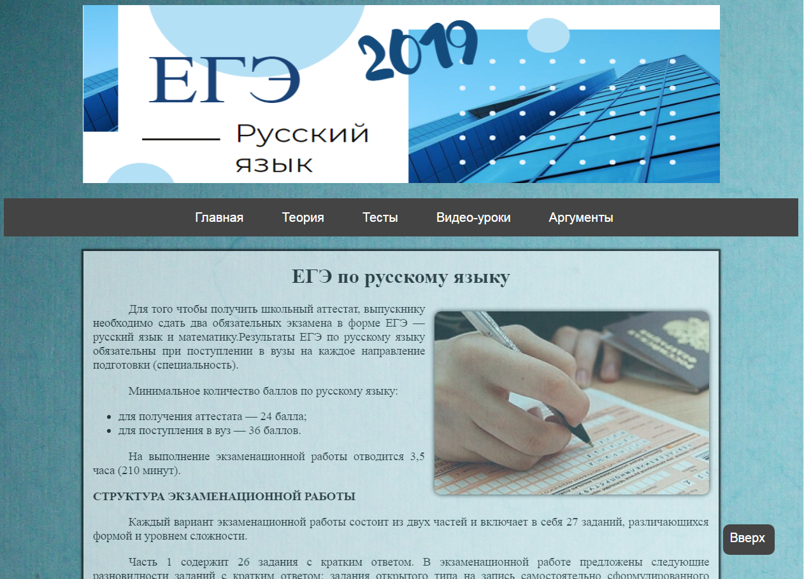
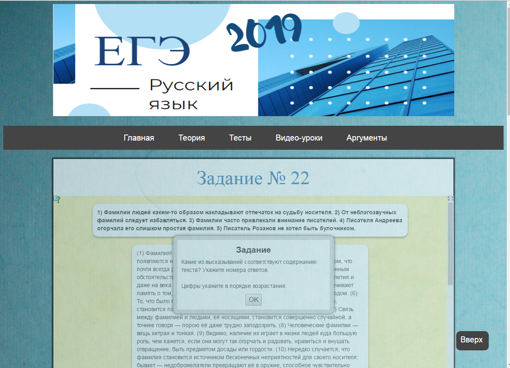
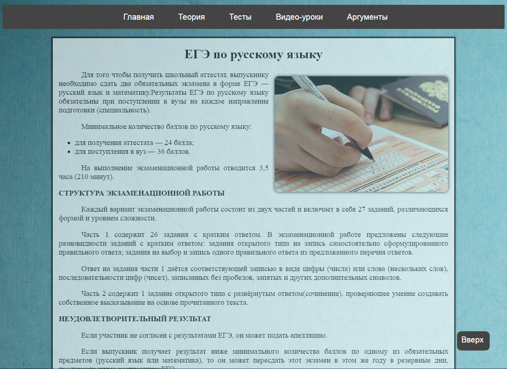
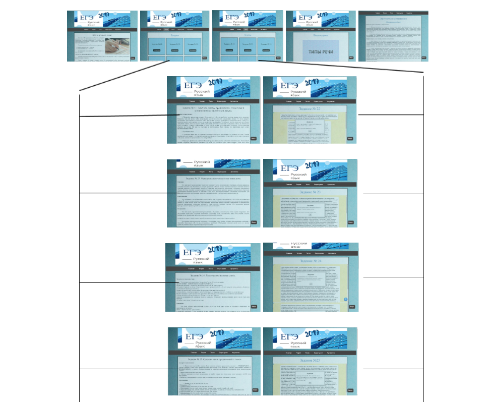

# Подготовка к ЕГЭ по русскому языку. Сочинение
## Введение
В настоящее время мы сталкиваемся с огромным количеством информации. Нам трудно понимать, искать, воспринимать, учить различные материалы. Большой объем отобранной и структурированной информации, организованный в виде сайта, является прекрасным помощником при подготовке к ЕГЭ и учебной проектной деятельности. Именно поэтому разработка информационно-обучающего сайта по русскому языку является актуальным.

В этом учебно-методическом пособии содержится структурированная информация по предмету, которая может служить как дополнительный материал для самостоятельного обучения, так и наглядное пособие для представления на уроке.

## Основная часть
### Цель
Создать учебно-методическое пособие для подготовки к ЕГЭ по русскому языку, оформленное в виде Web-сайта.

## Задачи
+ Изучить материал
+ Собрать и систематизировать информацию
+ Создать макет сайта
+ Разработать дизайн
+ Создать HTML-код
+ Заполнить и отредактировать текст на Web-странице
+ Разработать тестовые задания
+ Создать видео

## Реализация проекта

### Этапы работы
1. Определение проблемы и ее актуальности
2. Сбор и систематизация информации по теме
3. Оформление проекта
4. Подготовка публичного выступления и защита проекта

### Дизайн сайта
Люди индивидуальны.  Каждый по-разному воспринимает информацию. Для того чтобы сайт был удобен для широкой аудитории, он включает в себя как текстовые, так и видео-файлы.

Мною была выбрана спокойная цветовая гамма. Оттенки голубого, синего, бирюзового, серого и белого сочетаются между собой. У «морского» цвета нет дна. Он умеет затягивать в себя внимание любого. Шрифт, размер текста, цвет гиперссылок выбраны наиболее подходящие для восприятия.

Сайт имеет деловой стиль, т.к. цель создания сайта создать учебно-методическое пособие.

## Теоретический материал

1. Теги HTML

    Основные теги, используемые в моем сайте:
    + `<html></html>` - Указывает программе просмотра страниц, что это HTML документ.
    + `<head></head>` - Определяет место, где помещается различная информация, не отображаемая в теле документа.
    + `<body></body>` - Определяет видимую часть документа.
    + ` ` - Переход на новую строку
    + `<front color= “…” ></front> ` - Устанавливает цвет текста, используя значение цвета в виде RRGGBB
    + `<b></b>` - Создает жирный текст
    + `<i></i>` - Создает наклонный текст
    + `<front size= “…” ></front>` - Устанавливает размер текста в пределах от 1 до 7
    + `` - Создает гиперссылку на другую страницу
    + `

` - Создает новый параграф
    + `

` - Выравнивает параграф относительно центра
    + `

` - Выравнивает параграф относительно одной из сторон документа, значения: left, right, justify или center
    + `` - Добавляет изображение в HTML документ
    + `<th></th>` - Создание одной ячейки таблицы, которая обозначается как заголовочная
    + `<ul></ul>` - Устанавливает маркированный список
    + `<li></li>` - Элемент маркированного списка
    + `

` - Блочный элемент
    + `` - Подключение скрипта к HTML-странице
    + `<h1></h1>` - Заголовок первого уровня
    + `<h3></h3>` - Заголовок третьего уровня
    + `<video controls></video>` - Добавляет панель управления к видеоролику
    + `<source src=”…”>` - Указывает путь к воспроизводимому видео-ролику

2. CSS

    Существуют три способа подключения CSS: внутренний, таблица глобальных стилей и таблица связных стилей.

    В своём сайте я использовала связные стили.
    
    При использовании связных стилей описание селекторов и их значений располагается в отдельном файле, как правило, с расширением CSS, а для связывания документа с этим файлом применяется тег `<link>`. Данный тег помещается в контейнер `<head>`.

3. Создание тестов

	Все представленные на сайте задания созданы на сайте “LearningApps” и вставлены с помощью тега `<iframe>`.

4. Верстка

	Существует три вида верстки: фреймовая, блочная и табличная. При создании своего сайта я использовала блочную верстку. При блочной верстке существенное значение уделяется универсальному тегу `

`, который выполняет множество функций. Используя его, мы можем делить страницу на блоки.

5. Работа с текстом

	Текст на сайте был отформатирован для более быстрого и облегченного восприятия информации другими людьми.
	Списки являются универсальным способом представить информацию в наглядном и понятном виде. Списки в HTML бывают: нумерованные, маркированные и т.д. Я использую маркированные списки.

5. Структура сайта

## Заключение
В процессе работы над проектом я скомпоновала и систематизировала информацию по данной теме. Я приобрела новые навыки и умения в области  HTML, закрепила знания в создании сайтов. Мной создано учебно-методическое пособие, включающее в себя текстовые и видео материалы, а также тесты. Это не только значительно упрощает запоминание информации, но и позволяет использовать данный сайт для подготовки к ЕГЭ.  Материалы сайта могут быть использованы учителями и учениками на уроках русского языка. Дизайн сайта не отвлекает от общей цели посещения сайта, информация легко воспринимается. 

## Источники
1. https://rus-ege.sdamgia.ru/ - Теория/тесты
2. https://4ege.ru/russkiy/3001-rechevye-klishe-po-russkomu-yazyku-k-sochineniyu.html - Теория
3. https://4ege.ru/russkiy/57167-ege-2019-gotovimsya-k-sochineniyu-v-novom-formate.html - Теория
4. https://egeshik.ru/russkiy-ege/sochineniye-ege-2019/kak-pisat-sochinenie-po-russkomu-yazyku-ege-2019-shablon-s-primerom.html - Теория
5. https://learningapps.org/ - Тесты
6. https://rustutors.ru/ege.html - фффффффффффТеория